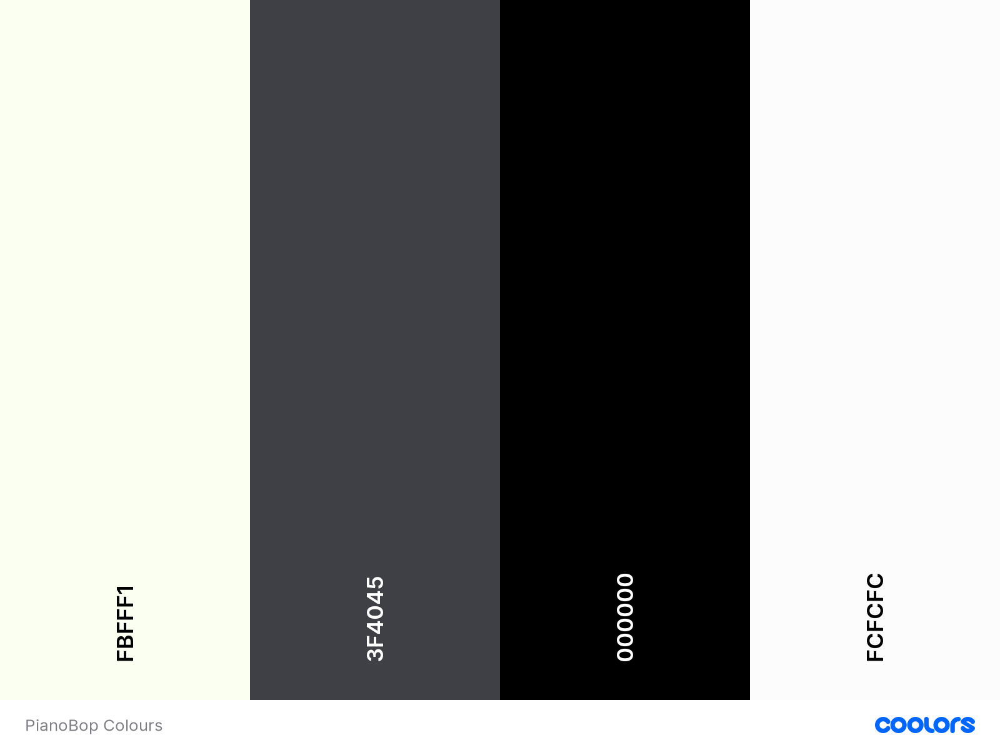

# Piano Bop

Piano Bop is a web page that provides the user with a fun game to play. The game takes it's inspiration from the original Simon game but with it's own twist on it, the twist being that it's played through a piano keyboard. When the keys are pressed, they make a sound which represents a note on the piano.

The game is primarily about providing the user with a fun time, but it has other goals. It aims to inspire people to begin playing music, whether that is piano, guitar or any other instrument. Through playing the game, people will hopefully realise that they can easily learn to play a couple of songs which might start them on their journey to learning to play. 

Piano Bop aims to be a really simple game and web-page overall that doesn't take any time or skill to start playing. I hope you enjoy!

## Table of Contents
* User Experience (UX)
    * Site Owner Goals
    * User Goals
    * User Stories
    * User Requirements
    * User Expectations
    * Design Choices
        * Fonts
        * Colours
* Features
    * Implemented Features
    * Features Not Yet Implemented
* Technologies Used
* Testing
* Bugs
* Deployment
* Credits
* Final Comments

## User Experience (UX)

### Site Owner Goals
* I want to give the users of my site a positive experience with a game that evokes positive emotions
* I want to have a visually appealing website
* I want the users to feel like they are testing their short-term memory and attention span
* I want the users to be able to provide valuable feedback

### User Goals
* To have fun while playing the game
* For the game to be responsive so that I can play on various devices
* To feel like my short-term memory is being challenged 
* To be able to see my score throughout the duration of the game 
* To be give feedback based on my choices - interactivity

### User Stories
* As a user, I would like to track my score throughout the game
* As a user, I would like to be able to choose a variety of difficulties based on my skill level
* As a user, I would like to be given some positive feedback when I get past a level of the game
* As a user, I would like to be given some feedback when I fail at a level
* As a user, I would like to be able to give the game designer some feedback on how to improve the game features
* As a user, I would like to have the game be as simple as possible to play
* As a user, I would like to have some instructions on how to play the game made available to me at a click of a button
* As a user, I would like to be able to see the game developer’s Github page to see if they have any other cool games to play
* As a user, I would like to be able to pick a colour theme for the website

### User Requirements
* The site needs to be easy to navigate between the different pages via navbar
* To have a landing page that tells the user what the page is at a glance
* To have a well laid out page that is easy to use and understandable
* To get feedback from the game when I win or lose in a level of the game
* To be able to see the score throughout the game 

### User Expectations
* To have instructions on how to play the game
* To give the website developer some feedback 
* To be able to contact the site owner to give feedback
* To be able to choose a difficulty level 
* To be able to start the game when I am ready to play for a positive UX

### Design Choices
To keep the game nice and simple for the user, I decided to keep the colour scheme nice and basic. The user’s attention should be drawn to the game area as soon as possible with no confusion about what the aim of the game is. To achieve this, the game area is going to be placed in the middle of the screen with a contrasting background colour.

#### Fonts: 
There is very little writing on the landing page so as not to confuse the user and to not take attention away from the game area. For the fonts, I decided to go to [Google Fonts](https://fonts.google.com/?standard-styles=) which is great for getting any kind of font you want. The fonts I chose for my page are *Roboto* & *Lato* with *sans-serif* as a backup font in the event that Google Fonts does not work. 

#### Colours:
When deciding what colour scheme to choose for my project, I decided to keep it really simple with mainly block colours and little design so as to keep the site looking simple yet sleep and visually appealing.

I used [Coolors](https://coolors.co/) to generate a colour scheme for the site. This is a really cool site that randomly generates colour schemes. You can just keep generating new colour schemes until you find one that fits what your requirements are. When the colour scheme comes up, it provides you with the Hex value of the colours so you can just copy and paste it into your code. See below for my choice of colour scheme. 

The HEX values of the colours that I used are: 
* #FBFFF1 - Ivory 
    * I picked this colour for my piano keys as this is what colour they are in real life.

* #3F4045 - Onyx
    * I picked this colour as it is a dark gray colour which matches the theme of the black and white piano.

* #30292F - Black Coffee
    * I picked this colour, again because it is close to black and will work well as the black keys on the piano among other items on the page

* #58A4B0 - Cadet Blue
    * I picked this colour to add an injection of colour into the page and give it an appealing look. This will be used in various items on the page including headers and borders etc

* #FCFCFC - White 
    * I picked white to be in my website colour scheme as it is a simple colour that contrasts well to all other colours and is keeping with the theme of the piano

#### Icons
I used some music icons to add some design to the page and keep with the music theme. I got these from [Font Awesome](https://fontawesome.com/) which is a great website for all your icon needs. I feel that the icons just add a little bit of extra style to the page and make it overall a bit more visually appealing. 

## Features 
### Implemented Features
* Title section at the top of the page
* Play button to begin the game
* Score area outlining the score and the level of the user
* Game area where the piano is located
* Interactive piano keys
* Musical notes attached to piano keys
* Footer which provides the user a link to the site owners Github profile
*  A responsive design that accomodates multiple devices
* Feedback form operating through Email.js which provides the user with an personalised automatic, response to let them know that their feedback has been received
* Feedback on how they are doing in the game 
* Button feedback for every button pressed or click they make through audio and visual

### Features Yet To Be Implemented 
* Giving the use the option to choose different difficulty levels 
* Have a song played through the piano for the user to attempt to repeat

## Technologies Used
* [HTML 5](https://en.wikipedia.org/wiki/HTML) - HTML5 is a markup language I used for structuring and presenting content of my site
* [CSS3](https://en.wikipedia.org/wiki/CSS) - A language used to style the presentation of the content written in HTML5
* [Bootstrap](https://getbootstrap.com/docs/4.6/getting-started/introduction/) 4 - A front-end framework which assist me in creating responsive website design
* [Google Fonts](https://fonts.google.com/) - An open-source online library of thousands of fonts and icons that were free and easy to use.
* [Coolors](https://coolors.co/) - Used this to generate a colour scheme that matched what I wanted for the site.
* [Font Awesome](https://fontawesome.com/) - An open source online library of icons which I used for extra styling.
* [Balsamic](https://balsamiq.com/) - Software used to complete the wireframes. This was much easier than trying to draw.
* [Git](https://en.wikipedia.org/wiki/Git) - System used for version control.
* [GitHub](https://github.com/) - This is where my project repository was stored.
* [GitPod](https://www.gitpod.io/) - Open source, online workspace used to work on my project.
* [JQuery](https://jquery.com/) - A JavaScript library that assists in quickly writing JavaScript in a user-friendly and readable way
* [W3 HTML Validator](https://validator.w3.org/) - Used to validate my code to ensure that there were no errors.
* [W3 CSS Validator](https://jigsaw.w3.org/css-validator/) - Used to validate my code to ensure that there were no errors.
* [Google https://developer.chrome.com/docs/devtools/Chrome Dev Tools]() - A set of development tools to assist the user create web content. They are built directly into the browser
* [Lighthouse](https://chrome.google.com/webstore/detail/lighthouse/blipmdconlkpinefehnmjammfjpmpbjk?hl=en) - One of the Chrome Dev Tools which was used to assess the level of accessibility, performance and correctness that was provided by the site.
* [JS Fiddle](https://jsfiddle.net/) - An online playground IDE used to test and trial Javascript code with HTML and CSS
* [Youtube](https://www.youtube.com/) - Youtube videos are a great way to learn how to do different things if stuck on a particular piece of code

## Testing
### User Story Testing
1. 
2. 
3. 
.
.
.

### Validator Testing 
#### HTML Validator
* Errors:

* Fixes

#### CSS Validator
* Errors
* Fixes

## Bugs

### Bug 1
### Fix 1

### Bug 2
### Fix 2 

## Deployment

## Credits

## Final Comments